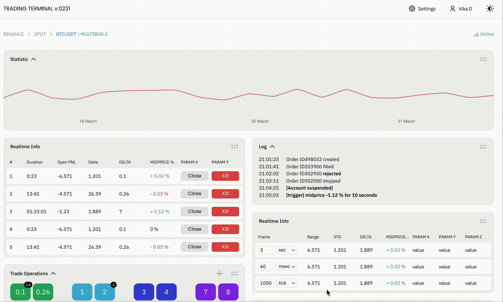

# Trading Platform Concept

The concept is a trading platform built on Vue 3 + Vite + Typescript. It includes dynamic components, drag and drop functionality, and both light and dark themes.

## Demo

A live demo is available at [website](https://noctua815.github.io/trading-platform-vue/).


## Used technologies

- 🎁 **Project:** Vite, Vue 3, typescript
- 🛠️ **Tools:** npm, eslint, scss, pug, prettier, conventional commits

## How to run the app
1. Install Node.js (the project uses Node.js version 18.12.0.). 
2. Install npm.
3. Clone the repository.
4. Type and run: `npm i` in the root directory.
5. Type and run: `npm run dev` in the root directory.
6. Open `http://localhost:5173` in your browser to see the app.

## NPM Scripts

This project uses the following NPM scripts:

### `dev`
Starts the development server using Vite. Open http://localhost:5173 to see your application.

```sh
npm run dev
```

### `build`
Builds the project for production. First, vue-tsc is run for TypeScript type checking, then vite build creates an optimized build of the application.

```sh
npm run build
```

### `preview`
Starts a local server to preview the built project. Used to check the final build before deployment.
```sh
npm run preview
```

### `preview`
Runs ESLint to check the code in files with .js and .vue extensions, ignoring files listed in .gitignore. Automatically fixes detected errors.

```sh
npm run lint
```

### `format`

Formats all code in the project using Prettier, ensuring a consistent code style.
```sh
npm run format
```

